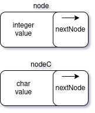
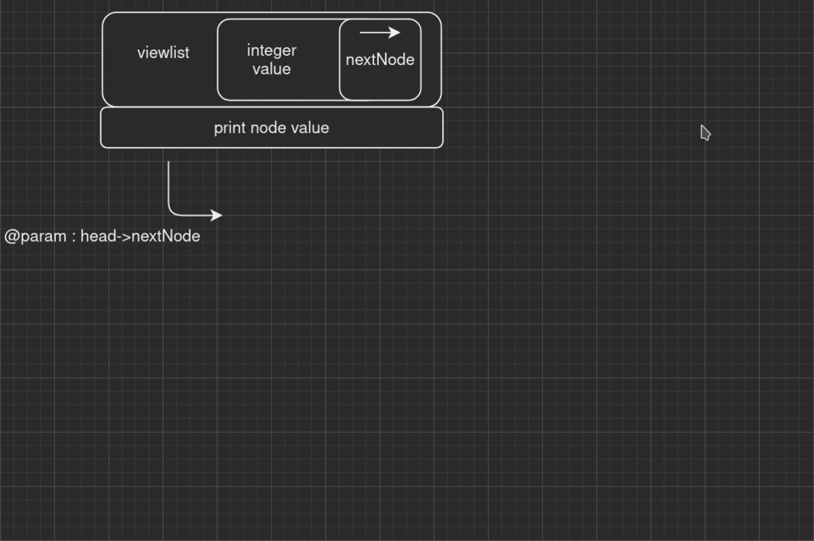
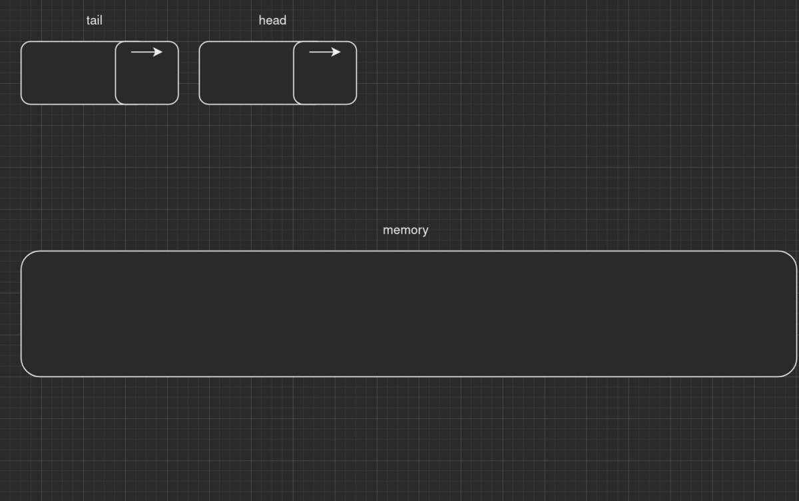
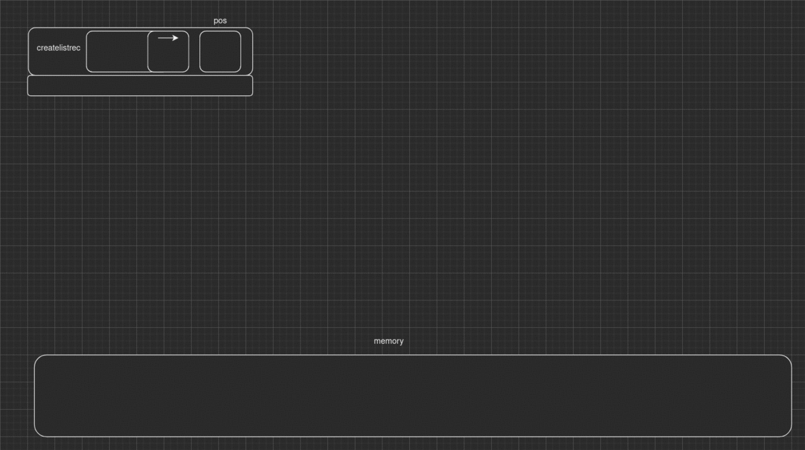
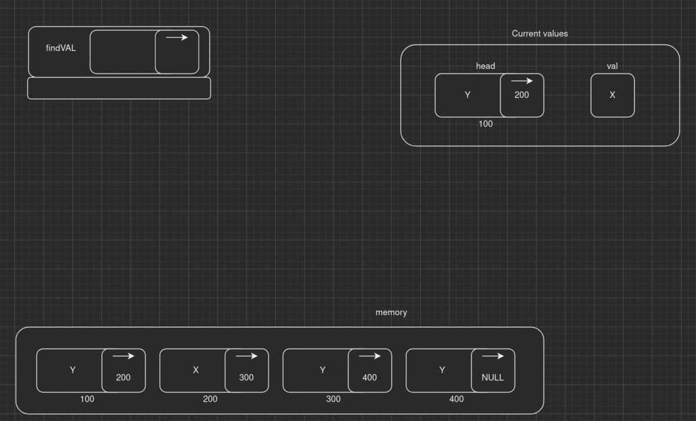
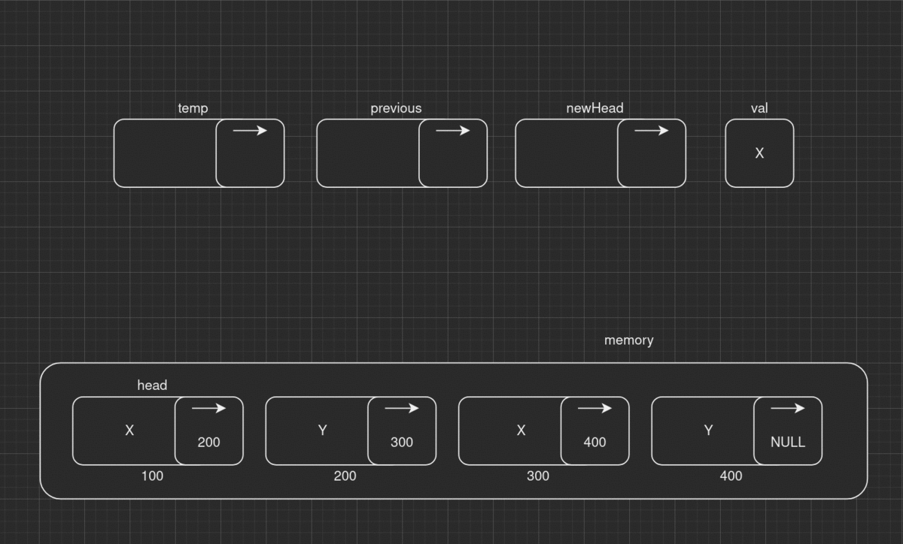

# Explaining C linked lists
This repository aims to collect the most useful tips and tricks when dealing with linked lists.

#### [ ! ] WARNING
At the moment the code is italian commented.

## Table of Contents
---
1. [Structs used](#Structs-used)
2. [Recurring algorithm patterns](#Recurring-algorithm-patterns)
    1. [Iterative creation of a list](#Iterative-creation-of-a-list)
    2. [Recursive creation of a list](#Recursive-creation-of-a-list)
    3. [Iterative deleting node](#Iterative-deleting-node)
    4. [Recursive insert node after](#Recursive-insert-node-after)
3. [Functions](#Functions)
    1. [viewlist](#viewlist-node-head)
    2. [viewlistC](#viewlistc-nodec-head)
    3. [createListseq](#createlistseq-node-head-int-pos)
    4. [createListrec](#createlistrec-node-head-int-pos)
    5. [removeVal](#removeval-node-head-int-val)
___
## Structs used

<table>
<tr>
    <td style="width:70%">
        Two main node structure.<br><code>node</code> aims to contain integer values , <code>nodeC</code> char values. They're pretty similar:
        First field contains the (int/char) value, the second one a pointer to the next (same structure) node.
    </td>
    <td style="width:30%">
        </img>
    </td>
</tr>
</table> 

## Recurring algorithm patterns
---
When dealing with creation of a list, insering and deleting a node, there are recurring functions patterns:

### Iterative creation of a list

```c
    node *tail=NULL;
    while ( /*CONDITION TO STOP NODE CREATION*/ )
    {
        if (head == NULL)
        {
            head = malloc(sizeof(node));
            tail = head;
            head->value = /*VALUE*/ ;
            head->nextNode = NULL;
        }
        else
        {
            node *temp = malloc(sizeof(node));
            tail->nextNode = temp;
            tail = temp;
            temp->value = /*VALUE*/ ;
            temp->nextNode = NULL;
        }
        //...OTHER INSTRUCTION FOR CONDITION
    }
    return head;
```
---

### Recursive creation of a list

```c
node *recursive(node *head, /*VARIABLE FOR ITERATION*/ )
{
    if ( /*CONDITION TO STOP NODE CREATION*/ )
    {
        return NULL;
    }
    if (head == NULL)
    {
        head = malloc(sizeof(node));
        head->value = /*VALUE*/ ;
        head->nextNode = recursive(head->nextNode,
        /*MODIFIED VARIABLE FOR ITERATION*/);
        return head;
    }
    else
    {
        node *temp = malloc(sizeof(node));
        temp->value = /*VALUE*/;
        temp->nextNode = recursive(head->nextNode,
        /*MODIFIED VARIABLE FOR ITERATION*/);
        return temp;
    }
}
```
---
### Iterative deleting node

```c
    node *temp = head;
    node *previous = NULL;
    node *newHead = head;
    while (temp != NULL)
    {
        if (/*NODE CONDITION TO GET DELETED*/)
        {
            if (previous != NULL) 
            {
                previous->nextNode = temp->nextNode;
                node *toFREE=temp;
                temp = temp->nextNode;
                free(toFREE);
            }
            else 
            {
                node *toFREE=temp;
                temp = temp->nextNode;
                newHead = temp;
                free(toFREE);
            }
        }
        else
        {
            previous = temp;
            temp = temp->nextNode;
        }
    }
    return newHead;

```
---
### Recursive insert node after

```c
   
node *insertion(node *head)
{
    if(head==NULL)
    {
        return NULL;
    }
    else
    {
        if(/*INSERT CONDITION*/)
        {
            node *toINSERT = malloc(sizeof(node));
            toINSERT->value= /*VALUE*/;
            toINSERT->nextNode=head->nextNode;
            head->nextNode=toINSERT;
        }
        return insertion(head->nextNode);
    }
}

```
---

## Functions
---
All functions are written in lib.c file. Below are explained.

### viewlist (node *head)
- *description*: 
    <br>Recursively print all linked nodes form a given head pointer. 
- *param*:
    <br> <code>node *head</code>: pointer to the first node of the linked list.
- *return*:
    <br> void
- *see*: 
    <br> prints only <code>node</code> type of nodes.

<table>
    <tr>
        <td style="width:50%">
            Space complexity
        </td>
        <td style="width:50%">
            Time complexity
        </td>
    </tr>
    <tr>
        <td style="width:50%">
        <b>O ( len( list ) )</b><br> where <code>len()</code> is a function returning the node number of the list and <code>list</code> is the object representing the linked list.<br>
        Max activation record invoked are given by the number of nodes in the linked list.
        </td>
        <td style="width:50%">
        <b>O ( len( list ) )</b><br> where <code>len()</code> is a function returning the node number of the list and <code>list</code> is the object representing the linked list.<br>
        The number of iterations is equal to the time complexity of the function, since this number is dependent by the maximum number of records invoked, those values are the same.
        </td>
    </tr>
</table> 
<br>

Execution<br>


### viewlistC (nodeC *head)
- *description*: 
    <br>Recursively print all linked nodes form a given head pointer. 
- *param*:
    <br> <code>nodeC *head</code>: pointer to the first node of the linked list.
- *return*:
    <br> void
- *see*: 
    <br> prints only <code>nodeC</code> type of nodes.

<table>
    <tr>
        <td style="width:50%">
            Space complexity
        </td>
        <td style="width:50%">
            Time complexity
        </td>
    </tr>
    <tr>
        <td style="width:50%">
        <b>O ( len( list ) )</b><br> where <code>len()</code> is a function returning the node number of the list and <code>list</code> is the object representing the linked list.<br>
        Max activation record invoked are given by the number of nodes in the linked list.
        </td>
        <td style="width:50%">
        <b>O ( len( list ) )</b><br> where <code>len()</code> is a function returning the node number of the list and <code>list</code> is the object representing the linked list.<br>
        The number of iterations is equal to the time complexity of the function, since this number is dependent by the maximum number of records invoked, those values are the same.
        </td>
    </tr>
</table> 
<br>

Execution:<br>
see viewlist.


### createLISTseq (node *head, int pos)
- *description*: 
    <br>Sequentially create a list with random value between 0 and GENMAX.
- *param*:
    <br> <code>node *head</code>: pointer to the first node of the linked list.
    <br> <code>int pos</code>: number of nodes to generate.
- *return*:
    <br> <code>node *</code>
- *see*: 
    <br> -

<table>
    <tr>
        <td style="width:50%">
            Space complexity
        </td>
        <td style="width:50%">
            Time complexity
        </td>
    </tr>
    <tr>
        <td style="width:50%">
        <b>O ( 1 )</b><br> 
        The fuction is called once.
        </td>
        <td style="width:50%">
        <b>O ( pos )</b><br>
        pos + 1 is the maximum number of iterations (due to number of comparison in the while loop), with high values the +1 term will not affect the curve described by the function, so its negligible.
        </td>
    </tr>
</table> 
<br>

Execution:<br>


### createLISTrec (node *head, int pos)
- *description*: 
    <br>Recursively create a list with random value between 0 and GENMAX.
- *param*:
    <br> <code>node *head</code>: pointer to the first node of the linked list.
    <br> <code>int pos</code>: number of nodes to generate.
- *return*:
    <br> <code>node *</code>
- *see*: 
    <br> -

<table>
    <tr>
        <td style="width:50%">
            Space complexity
        </td>
        <td style="width:50%">
            Time complexity
        </td>
    </tr>
    <tr>
        <td style="width:50%">
        <b>O ( pos )</b><br>
        Max activation record invoked are given by the number of nodes in the linked list.
        </td>
        <td style="width:50%">
        <b>O ( pos )</b><br>
        pos + 1 is the maximum number of comparison made, at least once when the function is called. At high values of pos, +1 will be negligible.
        </td>
    </tr>
</table> 
<br>

Execution:<br>


### createLISTseqUSER(node *head)
- *description*: 
    <br>Sequentially create a list using value inserted by user.
- *param*:
    <br> <code>node *head</code>: pointer to the first node of the linked list.
- *return*:
    <br> <code>node *</code>
- *see*: 
    <br> -

<table>
    <tr>
        <td style="width:50%">
            Space complexity
        </td>
        <td style="width:50%">
            Time complexity
        </td>
    </tr>
    <tr>
        <td style="width:50%">
        <b>O ( 1 )</b><br> 
        The fuction is called once.
        </td>
        <td style="width:50%">
        <b>O ( mod(val) )</b><br>
        where <code>mod()</code> is a function that returns the number of modification to the value in input. Actually it would be O(mod(val-1)), beacause the first assignment is indipendent by the while loop. 
        </td>
    </tr>
</table> 
<br>

Execution:<br>
See createLISTseq

### createLISTrecUSER(node *head)
- *description*: 
    <br>Recursively create a list using value inserted by user.
- *param*:
    <br> <code>node *head</code>: pointer to the first node of the linked list.
- *return*:
    <br> <code>node *</code>
- *see*: 
    <br> -

<table>
    <tr>
        <td style="width:50%">
            Space complexity
        </td>
        <td style="width:50%">
            Time complexity
        </td>
    </tr>
    <tr>
        <td style="width:50%">
        <b>O ( mod( val ) )</b><br> where <code>mod()</code> is a function that returns the number of modification to the value in input.
        Activation records are invoked till <code>val</code> value is 0.
        </td>
        <td style="width:50%">
        <b>O ( mod( val ) )</b><br> where <code>mod()</code> is a function that returns the number of modification to the value in input.
        This number is dependent by the maximum number of records invoked which is dependent by user input.
        </td>
    </tr>
</table> 
<br>

Execution:<br>
See createLISTrec

### createLISTseqFILE(nodeC *head,char path[])
- *description*: 
    <br>Sequentially create a list by characters in a file.
- *param*:
    <br> <code>nodeC *head</code>: pointer to the first node of the linked list.
    <br> <code>char path[]</code>: pointer to the char array containing the path of the file.
- *return*:
    <br> <code>nodeC *</code>
- *see*: 
    <br> -

<table>
    <tr>
        <td style="width:50%">
            Space complexity
        </td>
        <td style="width:50%">
            Time complexity
        </td>
    </tr>
    <tr>
        <td style="width:50%">
        <b>O ( 1 )</b><br> 
        The fuction is called once.
        </td>
        <td style="width:50%">
        <b>O ( charnumber(fp) )</b><br> 
        where <code>charnumber()</code> is a function that returns the number of ASCII characters in the file pointer <code>fp</code>.
        </td>
    </tr>
</table> 
<br>

Execution:<br>
See createLISTseq

### createLISTrecFILE(nodeC *head,FILE *fp)
- *description*: 
    <br>Recursively create a list by characters in a file.
- *param*:
    <br> <code>nodeC *head</code>: pointer to the first node of the linked list.
    <br> <code>FILE *fp</code>: pointer to the file stream.
- *return*:
    <br> <code>nodeC *</code>
- *see*: 
    <br> -

<table>
    <tr>
        <td style="width:50%">
            Space complexity
        </td>
        <td style="width:50%">
            Time complexity
        </td>
    </tr>
    <tr>
        <td style="width:50%">
        <b>O ( charnumber(fp) )</b><br> where <code>charnumber()</code> is a function that returns the number of ASCII characters in the file pointer <code>fp</code>.
        Max activation record invoked are given by the final number of nodes in the linked list +1.
        </td>
        <td style="width:50%">
        <b>O ( charnumber(fp) )</b><br> 
        where <code>charnumber()</code> is a function that returns the number of ASCII characters in the file pointer <code>fp</code>.
        </td>
    </tr>
</table> 
<br>

Execution:<br>
See createLISTrec

### findVAL(node *head,int val)
- *description*: 
    <br>Recursively count number of nodes containing <code>val</code> in a given linked list.
- *param*:
    <br> <code>node *head</code>: pointer to the first node of the linked list.
    <br> <code>int val</code>: value to find.
- *return*:
    <br> <code>int</code>
- *see*: 
    <br> -

<table>
    <tr>
        <td style="width:50%">
            Space complexity
        </td>
        <td style="width:50%">
            Time complexity
        </td>
    </tr>
    <tr>
        <td style="width:50%">
        <b>O ( len( list ) )</b><br> where <code>len()</code> is a function returning the node number of the list and <code>list</code> is the object representing the linked list.<br>
        Max activation record invoked are given by the number of nodes in the linked list.
        </td>
        <td style="width:50%">
        <b>O ( len( list ) )</b><br> where <code>len()</code> is a function returning the node number of the list and <code>list</code> is the object representing the linked list.<br>
        </td>
    </tr>
</table> 
<br>

Execution:<br>


### removeVAL (node *head,int val)
- *description*: 
    <br>Remove all nodes containing the value <code>val</code> from the linked list pointed by <code>head</code>
- *param*:
    <br> <code>node *head</code>: pointer to the first node of the linked list.
    <br> <code>int val</code>: value to delete.
- *return*:
    <br> <code>node *</code>
- *see*: 
    <br> -

<table>
    <tr>
        <td style="width:50%">
            Space complexity
        </td>
        <td style="width:50%">
            Time complexity
        </td>
    </tr>
    <tr>
        <td style="width:50%">
        <b>O ( 1 )</b><br> 
        The fuction is called once.
        </td>
        <td style="width:50%">
        <b>O ( len( list ))</b><br> where <code>len()</code> is a function returning the node number of the list and <code>list</code> is the object representing the linked list.<br>
        </td>
    </tr>
</table> 
<br>

Execution:<br>


### findCHAR(nodeC *head, char c)
- *description*: 
    <br>Recursively count number of nodes containing <code>c</code> character in a given linked list.
- *param*:
    <br> <code>nodeC *head</code>: pointer to the first node of the linked list.
    <br> <code>char c</code>: character to find
- *return*:
    <br> <code>int</code>
- *see*: 
    <br> -

<table>
    <tr>
        <td style="width:50%">
            Space complexity
        </td>
        <td style="width:50%">
            Time complexity
        </td>
    </tr>
    <tr>
        <td style="width:50%">
        <b>O ( len( list ) )</b><br> where <code>len()</code> is a function returning the node number of the list and <code>list</code> is the object representing the linked list.<br>
        Max activation record invoked are given by the number of nodes in the linked list.
        </td>
        <td style="width:50%">
        <b>O ( len( list ) )</b><br> where <code>len()</code> is a function returning the node number of the list and <code>list</code> is the object representing the linked list.<br>
        </td>
    </tr>
</table> 
<br>

Execution:<br>
See findval

### selectiveUPPER(nodeC *head, char c)
- *description*: 
    <br>Recursively transform all <code>c</code> characters into capital letters in a given linked list.
- *param*:
    <br> <code>nodeC *head</code>: pointer to the first node of the linked list.
    <br> <code>char c</code>: character to up.
- *return*:
    <br> <code>nodeC *</code>
- *see*: 
    <br> -

<table>
    <tr>
        <td style="width:50%">
            Space complexity
        </td>
        <td style="width:50%">
            Time complexity
        </td>
    </tr>
    <tr>
        <td style="width:50%">
        <b>O ( len( list ) )</b><br> where <code>len()</code> is a function returning the node number of the list and <code>list</code> is the object representing the linked list.<br>
        Max activation record invoked are given by the number of nodes in the linked list.
        </td>
        <td style="width:50%">
            [Time complexity]
        </td>
    </tr>
</table> 
<br>

Execution:<br>
See findval

